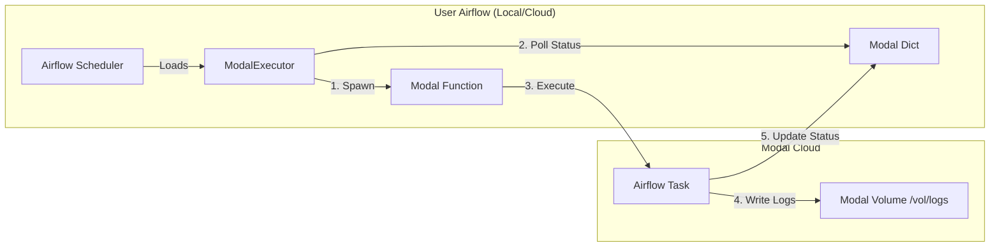

# Implementation Plan - Phase 1: ModalExecutor

## Goal
Build `modalflow`, a python package providing a `ModalExecutor` class. This executor allows standard Airflow environments (local, EC2, K8s) to run tasks as ephemeral Modal Functions.

## Architecture

## Core Components

### 1. `src/modalflow/executor/modal_executor.py`
Inherits from `airflow.executors.base_executor.BaseExecutor`.

-   **`__init__`**: Initializes Modal client and connects to the state dictionary.
-   **`execute_async(key, command, ...)`**: 
    -   Serializes the Airflow command (e.g., `airflow tasks run ...`).
    -   Spawns the `execute_modal_task` function on Modal.
    -   Updates local state to `QUEUED`.
-   **`sync()`**:
    -   Polls `modal.Dict` for task completion events.
    -   Updates Airflow task state (SUCCESS/FAILED) via `self.success()` / `self.fail()`.
    -   Handles timeouts and zombies.
-   **`terminate()`**: Clean shutdown.

### 2. `src/modalflow/modal_app.py`
Defines the Modal infrastructure.

-   **Image**: `modal.Image.from_registry("apache/airflow:2.10.2-python3.10")` + `pip install modal`.
-   **Volume**: `modal.Volume` named `airflow-logs` mounted at `/opt/airflow/logs` (or custom path).
-   **Dict**: `modal.Dict` named `airflow-task-state` for status coordination.
-   **Function**: `execute_modal_task(payload)`:
    -   Deserializes command.
    -   Sets up environment (environment variables passed from executor).
    -   Executes command via `subprocess`.
    -   Captures stdout/stderr to log file on Volume.
    -   Writes exit code/status to `modal.Dict`.

## Detailed Steps

### Step 1: Project Skeleton & Configuration
-   [ ] Rename/Move existing files to match `modalflow` structure.
-   [ ] Update `pyproject.toml` with dependencies: `apache-airflow`, `modal`.
-   [ ] Create `src/modalflow/executor/` and `src/modalflow/tests/`.

### Step 2: The Modal App Definition
-   [ ] Implement `modal_app.py` defining the generic Airflow image and shared Volume/Dict.
-   [ ] Implement the worker function `execute_modal_task` that runs the raw command and handles logging.

### Step 3: `ModalExecutor` Implementation
-   [ ] Implement `execute_async` to spawn the worker.
-   [ ] Implement `sync` to read from `modal.Dict`.
-   [ ] Implement `cleanup` logic (removing old keys from Dict).

### Step 4: Logging Integration
-   [ ] Ensure `execute_modal_task` writes logs to the correct hierarchy: `dag_id/task_id/run_id/attempt.log` on the Volume.
-   [ ] (Optional for V1) Implement a custom `TaskLogHandler` to read these logs back into the local UI, OR just rely on Modal dashboard logs for now.

## Future Phases (Preview)
-   **Phase 2**: Serverless Scheduler (Cron-based ticking function).
-   **Phase 3**: Full Native Deployment (Postgres backend, Webserver on Modal).

## Reference
-   `lambda_executor/`: Contains AWS Lambda reference implementation.
