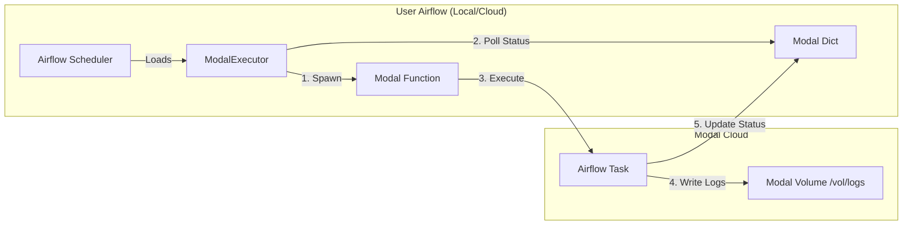

# Implementation Plan - Phase 1: ModalExecutor

## 12/29 Updates

- Using `breeze` instead of `astro` CLI for testing because it allows for remote testing runs. ie. (`breeze testing core ...`)
    - Is this a real benefit? Unit test should be mocked anyways, and integration tests can be done by spinning up a modal Sandbox and then testing within that
    - Decision: attempt to move to `astro` CLI, where we run the astro CLI in a modal Sandbox
- When spawning modal Functions in current design (Airflow 3.0+), the ExecuteTask workload (executed by `airflow.sdk.execution_time.execute_workload`) attempts to use the Task Execution API (AIP-72) to execute the task. This requires the worker to "phone home" to the executor, which means it makes a call to `http://localhost:8080/execution`. As expected because this call is being made from the modal Function to the local machine where the breeze Airflow testing stack is running, this call fails. This points to an issue with the networking setup of the Modal Function.
    - The Lambda Executor gets around this issue because it's expected the executing lambda is deployed in the same VPC/Networking stack as the Airflow deployment. For example, if the user is using MWAA deployed in a VPC, they would deploy the execution lambda in the same VPC, ensuring the Airflow deployment can "see" the worker invocations and vice-versa.

### Future ideas
- Migrate the modal Function to be a modal Sandbox (since there's no unique business logic, it's just a subprocess command), this also would make the solution deploy-free — users don't need to `modal deploy` before usage, all other primitives (App, logs Volume, Dict) can be created if they don't exist already in the Executor's `start()` function
- Dynamic caching (after Sandbox migration): for task names that are recurring, create a [Sandbox snapshot](https://modal.com/docs/guide/sandbox-snapshots), which is an Image, and store it in a lookup table/LRU cache. When the task comes up again, use this snapshot to enable faster task starts.
- Modal credentials as Airflow Connection object

## Goal
Build `modalflow`, a python package providing a `ModalExecutor` class. This executor allows standard Airflow environments (local, EC2, K8s) to run tasks as ephemeral Modal Functions.

## Architecture

## Core Components

### 1. `src/modalflow/executor/modal_executor.py`
Inherits from `airflow.executors.base_executor.BaseExecutor`.

-   **`__init__`**: Initializes Modal client and connects to the state dictionary.
-   **`execute_async(key, command, ...)`**: 
    -   Serializes the Airflow command (e.g., `airflow tasks run ...`).
    -   Spawns the `execute_modal_task` function on Modal.
    -   Updates local state to `QUEUED`.
-   **`sync()`**:
    -   Polls `modal.Dict` for task completion events.
    -   Updates Airflow task state (SUCCESS/FAILED) via `self.success()` / `self.fail()`.
    -   Handles timeouts and zombies.
-   **`terminate()`**: Clean shutdown.

### 2. `src/modalflow/modal_app.py`
Defines the Modal infrastructure.

-   **Image**: `modal.Image.from_registry("apache/airflow:2.10.2-python3.10")` + `pip install modal`.
-   **Volume**: `modal.Volume` named `airflow-logs` mounted at `/opt/airflow/logs` (or custom path).
-   **Dict**: `modal.Dict` named `airflow-task-state` for status coordination.
-   **Function**: `execute_modal_task(payload)`:
    -   Deserializes command.
    -   Sets up environment (environment variables passed from executor).
    -   Executes command via `subprocess`.
    -   Captures stdout/stderr to log file on Volume.
    -   Writes exit code/status to `modal.Dict`.

## Detailed Steps

### Step 1: Project Skeleton & Configuration
-   [x] Rename/Move existing files to match `modalflow` structure.
-   [x] Update `pyproject.toml` with dependencies: `apache-airflow`, `modal`.
-   [x] Create `src/modalflow/executor/` and `src/modalflow/tests/`.

### Step 2: The Modal App Definition
-   [x] Implement `modal_app.py` defining the generic Airflow image and shared Volume/Dict.
-   [x] Implement the worker function `execute_modal_task` that runs the raw command and handles logging.

### Step 3: `ModalExecutor` Implementation
-   [x] Implement `execute_async` to spawn the worker.
-   [x] Implement `sync` to read from `modal.Dict`.
-   [x] Implement `cleanup` logic (removing old keys from Dict).

### Step 4: Logging Integration
-   [ ] Ensure `execute_modal_task` writes logs to the correct hierarchy: `dag_id/task_id/run_id/attempt.log` on the Volume.
-   [ ] (Optional for V1) Implement a custom `TaskLogHandler` to read these logs back into the local UI, OR just rely on Modal dashboard logs for now.

## Future Phases (Preview)
-   **Phase 2**: Serverless Scheduler (Cron-based ticking function).
-   **Phase 3**: Full Native Deployment (Postgres backend, Webserver on Modal).

## Reference
-   `lambda_executor/`: Contains AWS Lambda reference implementation.
